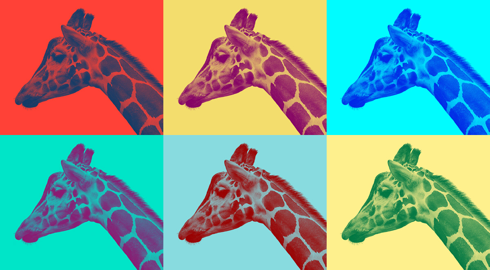
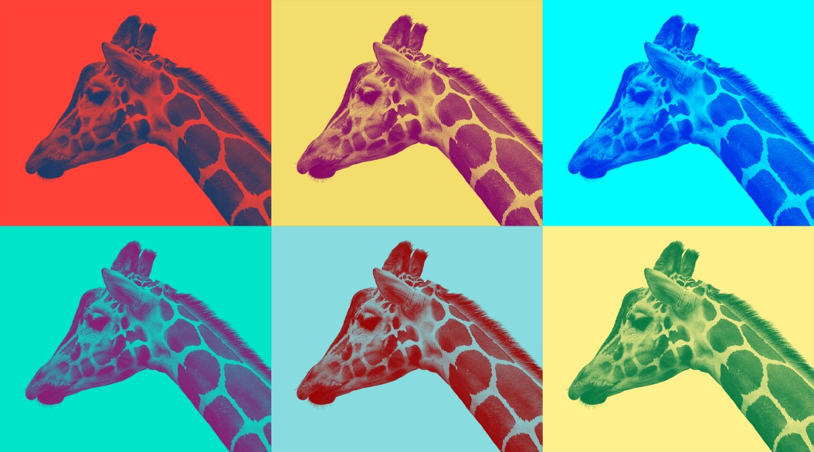

# Visual references

Looks we want Warholizer to reproduce, with notes on how. Each may become a canned recipe (a saved formula, see ADR 0001) once formulas exist.

## Warhol duotone grid (giraffe)

Six duotones of one photo, each with its own shadow ink and flat light background, in a 3 × 2 grid. Provided as a reference on 2026-10-08.

**Source:** [giraffe-source-bw.jpg](giraffe-source-bw.jpg) (960 × 800), almost certainly the original: same pose and crop, and the same ~1.2:1 aspect as each reference tile. High-contrast black and white on a pure white background.

**Observations**
- Each tile is a two-color gradient map: the subject's darks take a saturated or dark ink; the background (white in the source) becomes a flat light or bright color.
- Backgrounds are perfectly flat because the source background is pure white, which maps exactly to the light stop.
- The fine "engraved" fur texture comes from the sharp source photo itself; no screen or dither is needed.
- The source may have a faint frame line just inside its edges; crop a few pixels if it shows. JPEG noise in the whites can be flattened with a Levels white point around 245.
- Approximate pairs (shadow → background), left to right, top to bottom: navy → red-orange; plum → mustard; blue → cyan; magenta → teal; maroon → powder blue; forest green → butter yellow. Note the inversions: some tiles put the bright color in the background and the dark one in the subject, and a few pair a saturated ink with a pale ground.

**Recipe with today's operations** (Pure Editor)
1. Pipe: optional `crop` (trim any frame line), `levels` (white point ~245 so the background is exactly white).
2. Pipe: `copies` (n = 6).
3. Zip: six `gradientMap`s with two stops each, as listed above.
4. Pipe: `tile` (line length 3).

**Built-in recipe: "Warhol duotone grid"** (Pure Editor → Operations → Apply recipe…; `src/Warholizer/RasterOperations/recipes.ts`). Levels (white 245) → flatMap of six two-stop gradient maps with colors sampled from the reference → tile (3 per row). Output on the source photo:

**Future: a parameterized "Warhol grid"**
- Parameters: tile count / columns, a palette set (list of duotone pairs, or generated: complementary or analogous pairs around the hue wheel), texture (none, dither, halftone line screen), background clip strength.
- Expands to the formula above. Natural fit for the filter gallery: sweep palette sets.
- Works best with high-contrast sources on white or keyed (`colorKey`) backgrounds.
